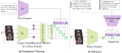

# EmoCLIP: A Vision-Language Method for Zero-Shot Video Facial Expression Recognition

Authors official PyTorch implementation of the **[EmoCLIP: A Vision-Language Method for Zero-Shot Video Facial Expression Recognition](??)**. If you use this code for your research, please [**cite**](#citation) our paper.

> **EmoCLIP: A Vision-Language Method for Zero-Shot Video Facial Expression Recognition**<br>
> Niki Maria Foteinopoulou and Ioannis Patras<br>
> ?? <br>
> 
>
> **Abstract**: Facial Expression Recognition (FER) is a crucial task in affective computing, but its conventional focus on the seven basic emotions limits its applicability to the complex and expanding emotional spectrum. To address the issue of new and unseen emotions present in dynamic in-the-wild FER, we propose a novel vision-language model that utilises sample-level text descriptions (i.e. captions of the context, expressions or emotional cues), as natural language supervision, aiming to enhance the learning of rich latent representations, for zero-shot classification. To test this, we evaluate using zero-shot classification of the model trained on sample-level descriptions, on four popular dynamic FER datasets. Our findings show that this approach yields significant improvements when compared to baseline methods. Specifically, for zero-shot video FER, we outperform CLIP by over 10\% in terms of Weighted Average Recall and 5\% in terms of Unweighted Average Recall on several datasets. Furthermore, we evaluate the representations obtained from the network trained using sample-level descriptions on the downstream task of mental health symptom estimation, achieving performance comparable or superior to state-of-the-art methods and strong agreement with human experts. Namely, we achieve a Pearson's Correlation Coefficient of up to 0.85, which is comparable to human experts' agreement.


## Overview

<p alighn="center">
 In a nutshell, we follow the  CLIP contrastive training paradigm to jointly optimise a video and a 
text encoder. The video and text encoders of the network are jointly trained using a contrastive loss over 
the cosine similarities of the video-text pairings in the mini-batch. 
More specifically, the video encoder ($E_V$) is composed of the CLIP image encoder ($E_I$) and a Transformer Encoder, 
to learn the temporal relationships of the frame spatial representations. The text encoder ($E_T$) used in our approach 
is the CLIP text encoder.  The weights of the image and text encoders in our model are initialised using the 
large pre-trained weights of CLIP, as FER datasets are not large enough to train a VLM from scratch with adequate 
generalisation. Contrary to the previous video VLM works in both action recognition and FER, we propose using sample 
level descriptions for better representation learning, rather than embeddings of class prototypes. This leads to more 
semantically rich representations which in turn allows for better generalisation. 
</p>


## Installation

We recommend installing the required packages using python's native virtual environment as follows:

```bash
$ python -m venv venv
$ source venv/bin/activate
(venv) $ pip install --upgrade pip
(venv) $ pip install -r requirements.txt
```

For using the aforementioned virtual environment in a Jupyter Notebook, you need to manually add the kernel as follows:

```bash
(venv) $ python -m ipykernel install --user --name=venv
```


## Citation

```bibtex
@inproceedings{foteinopoulou2023emoclip,
  title={EmoCLIP: A Vision-Language Method for Zero-Shot Video Facial Expression Recognition},
  author={Foteinopoulou, Niki Maria and Patras, Ioannis},
  year={2023}
}

```


<!--Acknowledgement: This research was supported by the EU's Horizon 2020 programme H2020-951911 [AI4Media](https://www.ai4media.eu/) project.-->

